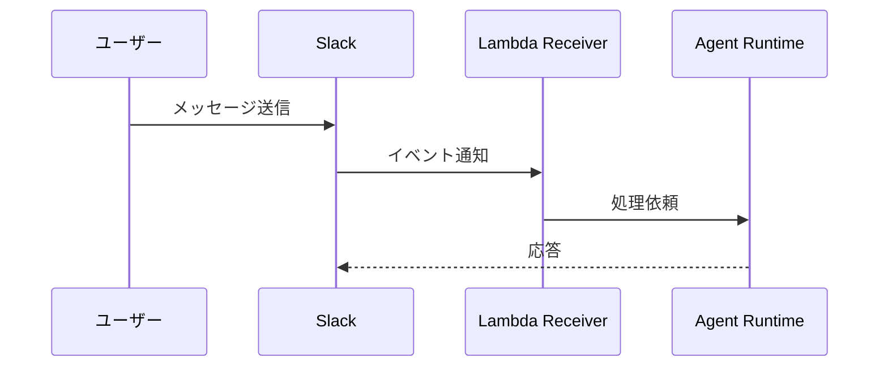

# Claude.md

## 概要
開発を進めるうえで遵守すべき標準ルールを定義します。

## プロジェクト構造

リポジトリ構造の詳細は `docs/repository-structure.md` を参照してください。

### ドキュメントの分類

#### 1. 永続的ドキュメント（`docs/`）

アプリケーション全体の「**何を作るか**」「**どう作るか**」を定義する恒久的なドキュメント。
アプリケーションの基本設計や方針が変わらない限り更新されません。

| ファイル | 内容 |
|---------|------|
| `product-requirements.md` | プロダクト要求定義書 |
| `functional-design.md` | 機能設計書 |
| `architecture.md` | 技術仕様書 |
| `repository-structure.md` | リポジトリ構造定義書 |
| `development-guidelines.md` | 開発ガイドライン |
| `glossary.md` | ユビキタス言語定義 |

#### 2. 作業単位のドキュメント（.steering/[YYYYMMDD]-[開発タイトル]/）

特定の開発作業における「**今回何をするか**」を定義する一時的なステアリングファイル。
作業完了後は参照用として保持されますが、新しい作業では新しいディレクトリを作成します。

- **requirements.md** — 今回の作業の要求内容
- 追加する機能の説明
- ユーザーストーリー
- 受け入れ条件
- 制約事項

- **design.md** — 変更内容の設計
- 実装アプローチ
- 変更するコンポーネント
- データ構造の変更
- 影響範囲の分析

- **tasklist.md** — タスクリスト
- 具体的な実装タスク
- タスクの進捗状況
- 完了条件

### ステアリングディレクトリの命名規則

```
.steering/[YYYYMMDD]-[開発タイトル]/
```


**例：**
- `.steering/20250103-initial-implementation/`
- `.steering/20250115-add-tag-feature/`
- `.steering/20250120-fix-filter-bug/`
- `.steering/20250201-improve-performance/`

## 開発プロセス

### 初回セットアップ時の手順

#### 1. フォルダ作成

```bash
mkdir -p docs
mkdir -p .steering
```

#### 2. 永続的ドキュメント作成（`docs/`）

アプリケーション全体の設計を定義します。
各ドキュメントを作成後、必ず確認・承認を得てから次に進みます。

1. `docs/product-requirements.md` — プロダクト要求定義書
2. `docs/functional-design.md` — 機能設計書
3. `docs/architecture.md` — 技術仕様書
4. `docs/repository-structure.md` — リポジトリ構造定義書
5. `docs/development-guidelines.md` — 開発ガイドライン
6. `docs/glossary.md` — ユビキタス言語定義

**重要：** 1ファイルごとに作成後、必ず確認・承認を得てから次のファイル作成を行う

#### 3. 初回実装用のステアリングファイル作成

初回実装用のディレクトリを作成し、実装に必要なドキュメントを配置します。

```bash
mkdir -p .steering/[YYYYMMDD]-initial-implementation
```

作成するドキュメント：
1. `.steering/[YYYYMMDD]-initial-implementation/requirements.md` — 初回実装の要求
2. `.steering/[YYYYMMDD]-initial-implementation/design.md` — 実装設計
3. `.steering/[YYYYMMDD]-initial-implementation/tasklist.md` — 実装タスク

### 4. 環境セットアップ

`docs/development-guidelines.md` を参照してください。

### 5. 実装開始

`.steering/[YYYYMMDD]-initial-implementation/tasklist.md` に基づいて実装を進めます。

### 6. 品質チェック

`docs/development-guidelines.md` の品質チェック規約に従い、リント・型チェックを実施します。

## 機能追加・修正時の手順

### 1. 影響分析

- 永続的ドキュメント（`docs/`）への影響を確認
- 変更が基本設計に影響する場合は `docs/` を更新

### 2. ステアリングディレクトリ作成

新しい作業用のディレクトリを作成します。

```bash
mkdir -p .steering/[YYYYMMDD]-[開発タイトル]
```

**例：**

```bash
mkdir -p .steering/20250115-add-tag-feature
```

### 3. 作業ドキュメント作成

作業単位のドキュメントを作成します。
各ドキュメント作成後、必ず確認・承認を得てから次に進みます。

1. `.steering/[YYYYMMDD]-[開発タイトル]/requirements.md` — 要求内容  
2. `.steering/[YYYYMMDD]-[開発タイトル]/design.md` — 設計  
3. `.steering/[YYYYMMDD]-[開発タイトル]/tasklist.md` — タスクリスト  

**重要：** 1ファイルごとに作成後、必ず確認・承認を得てから次のファイル作成を行う

#### 4. 永続的ドキュメント更新（必要な場合のみ）

変更が基本設計に影響する場合、該当する `docs/` 内のドキュメントを更新します。

#### 5. 実装開始

`.steering/[YYYYMMDD]-[開発タイトル]/tasklist.md` に基づいて実装を進めます。

#### 6. 品質チェック

`docs/development-guidelines.md` の品質チェック規約に従い、リント・型チェックを実施します。

## ドキュメント管理の原則

### 永続的ドキュメント（`docs/`）

- アプリケーションの基本設計を記述
- 頻繁に更新されない
- 大きな設計変更時のみ更新
- プロジェクト全体の「北極星」として機能

### 作業単位のドキュメント（`.steering/`）

- 特定の作業・変更に特化
- 作業ごとに新しいディレクトリを作成
- 作業完了後は履歴として保持
- 変更の意図と経緯を記録

## 図表・ダイアグラムの記載ルール

### 記載場所

設計図やダイアグラムは、関連する永続的ドキュメント内に直接記載します。  
独立した diagrams フォルダは作成せず、手間を最小限に抑えます。

**配置例：**
- ER図、データモデル図 → `functional-design.md` 内に記載
- ユースケース図 → `functional-design.md` または `product-requirements.md` 内に記載
- シーケンス図 → `functional-design.md` 内に記載
- システム構成図 → `functional-design.md` または `architecture.md` 内に記載

### 記述形式
1. **Mermaid 記法（推奨）**

- Markdown に直接埋め込める
- バージョン管理が容易
- ツール不要で編集可能



2. **ASCII アート**

- シンプルな図表に使用
- テキストエディタで編集可能

```text
+--------+
| Header |
+--------+
     |
     v
+-----------+
| Task List |
+-----------+
```

3. **画像ファイル（必要な場合のみ）**

- 複雑なワイヤーフレームやモックアップ
- `docs/images/` フォルダに配置
- PNG または SVG 形式を推奨

### 図表の更新

- 設計変更時は対応する図表も同時に更新
- 図表とコードの乖離を防ぐ

## Git & Issue 管理

- Git操作は必ずGitHub MCPを使用する（bash gitコマンドは使わない）
- 機能追加やバグ修正を始める前に、GitHub Issueを作成する
- 作業時は `git worktree` を使用してブランチごとに別ディレクトリで作業する
- コミットメッセージにはIssue番号を含める（例: "fix #3: カレンダーMCP追加"）
- コミットメッセージにClaudeの署名（Co-Authored-By等）は含めない
- PRを作成する際は変更内容を明確に記載する

## MCP 使用ルール

- 利用可能なMCPサーバー: github, aws-documentation, cdk-mcp-server, amazon-bedrock-agentcore-mcp-server
- GitHub操作（issue, PR, code search等）はgithub MCPを使用
- AWSドキュメント参照はaws-documentation MCPを使用

## 注意事項

- ドキュメントの作成・更新は段階的に行い、各段階で承認を得る
- `.steering/` のディレクトリ名は日付と開発タイトルで明確に識別できるようにする
- 永続的ドキュメントと作業単位のドキュメントを混同しない
- コード変更後は必ずリント・型チェックを実施する
- セキュリティを考慮したコーディング（IAM最小権限原則、シークレット管理、入力バリデーションなど）
- 図表は必要最小限に留め、メンテナンスコストを抑える
