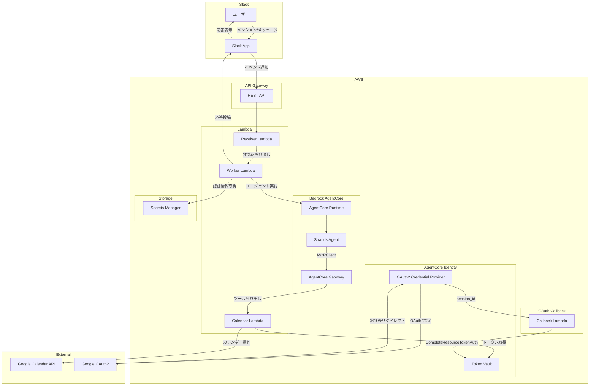
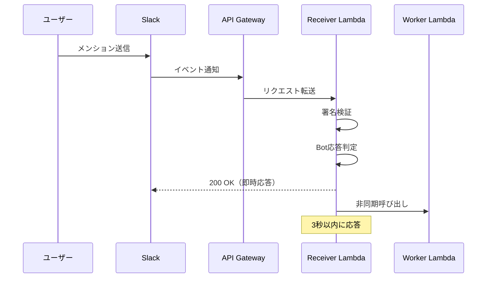
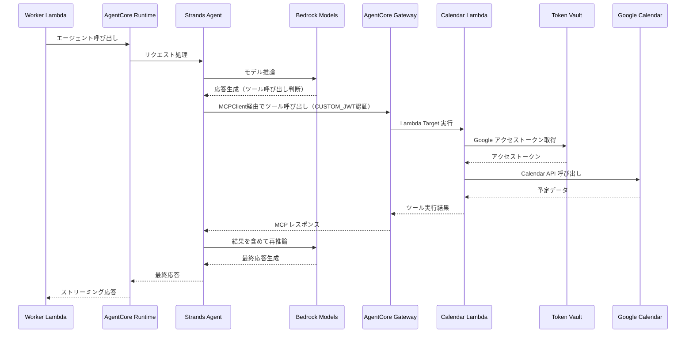
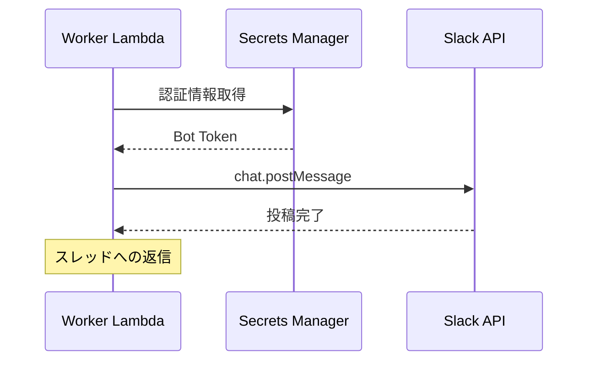
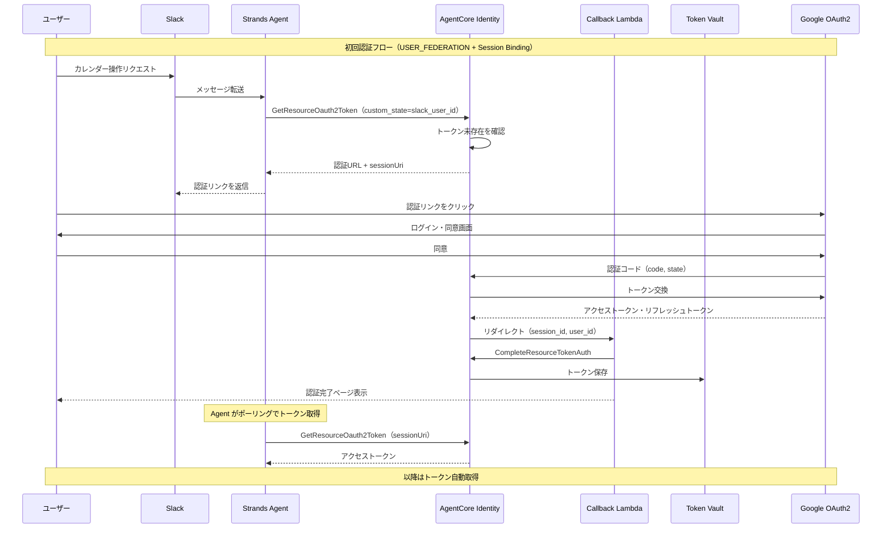
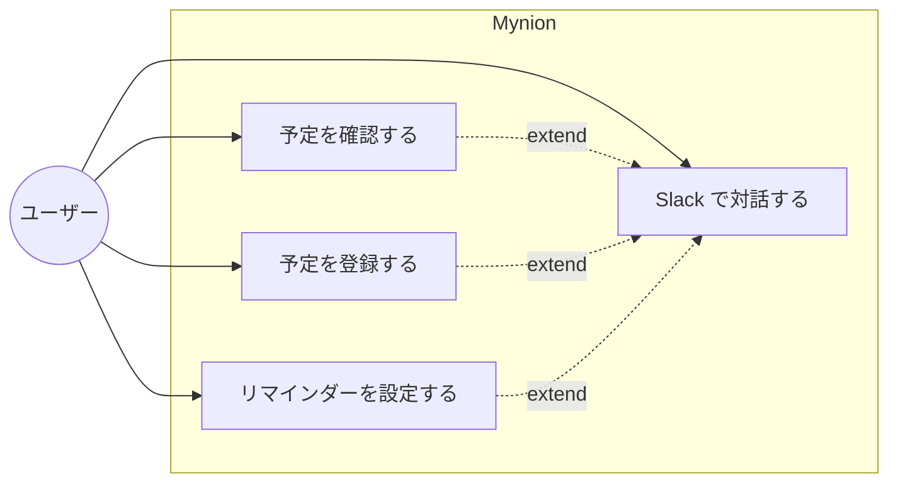

# 機能設計書

## システム構成図



## 機能ごとのアーキテクチャ

### 1. Slack イベント受信機能



**設計ポイント:**
- Slack の 3 秒タイムアウト制約に対応するため、Receiver は即座に 200 OK を返す
- 実際の処理は Worker Lambda に非同期で委譲
- HMAC-SHA256 による署名検証でセキュリティを確保

### 2. AI エージェント処理機能（Gateway 経由）



**設計ポイント:**
- Strands Agent は MCPClient 経由で AgentCore Gateway に接続
- Gateway が Lambda ターゲットとしてカレンダー操作ツールを提供
- MCP 標準プロトコルによるツール呼び出しで拡張性を確保
- **Inbound Auth**: CUSTOM_JWT 認証で Gateway アクセスを保護（Cognito OAuth トークン）
- **Outbound Auth**: AgentCore Identity 経由で Google OAuth2 トークンを取得
- **セッション ID 生成**: Slack thread_ts（16文字程度）を UUID v5 で変換し、AgentCore の 33 文字以上要件を満たす
  - Namespace: 固定 UUID（`SLACK_SESSION_NAMESPACE`）
  - 変換式: `uuid.uuid5(SLACK_SESSION_NAMESPACE, thread_id)`

### 3. Slack 応答機能



**設計ポイント:**
- 認証情報は Secrets Manager で安全に管理
- 元のメッセージのスレッドに返信
- エラー時も適切なメッセージを返す

### 4. Google OAuth2 認証フロー（AgentCore Identity + Session Binding）



**設計ポイント:**
- **OAuth2 Credential Provider**: Google OAuth2 クライアント情報を登録
- **USER_FEDERATION フロー**: ユーザー同意を経てトークンを取得
- **Session Binding**: `CompleteResourceTokenAuth` API で認証セッションをユーザーにバインド
  - 認証を開始したユーザーと完了したユーザーが同一であることを確認
  - Authorization URL が他人に転送されても、セッションがバインドされないため安全
- **Token Vault**: トークンを安全に保存・自動リフレッシュ
- **セッション管理**: Slack user_id を `custom_state` で渡してセッション追跡

## コンポーネント設計

### Receiver Lambda (`interfaces/slack/receiver.py`)

| 責務 | 説明 |
|------|------|
| 署名検証 | Slack からのリクエストの正当性を検証 |
| URL 検証 | Slack App 設定時の challenge 応答 |
| イベント判定 | Bot 自身のメッセージを無視 |
| Worker 呼び出し | 非同期で Worker Lambda を起動 |

### Worker Lambda (`interfaces/slack/worker/handler.py`)

| 責務 | 説明 |
|------|------|
| 認証情報管理 | Secrets Manager から認証情報を取得 |
| エージェント呼び出し | AgentCore Runtime を呼び出し |
| 応答処理 | ストリーミング応答を処理 |
| Slack 投稿 | 結果を Slack に投稿 |

### Agent (`agent.py`)

| 責務 | 説明 |
|------|------|
| FastAPI サーバー | `/invocations` エンドポイント提供 |
| Strands Agent | AI エージェントのロジック |
| MCPClient | Gateway 経由でツールを取得・実行 |

### AgentCore Gateway

| 責務 | 説明 |
|------|------|
| MCP サーバー | Strands Agent に MCP エンドポイントを提供 |
| ツール管理 | Lambda ターゲットをツールとして公開 |
| Inbound 認証 | CUSTOM_JWT 認証（Cognito OAuth トークン）で Gateway アクセスを保護 |
| セマンティック検索 | ツールの自動選択をサポート |

### AgentCore Identity

| 責務 | 説明 |
|------|------|
| Credential Provider | Google OAuth2 クライアント設定を管理 |
| USER_FEDERATION | ユーザー同意フローを処理 |
| Token Vault | アクセストークンを安全に保存 |
| トークン更新 | リフレッシュトークンで自動更新 |

### OAuth Callback Lambda (`interfaces/slack/oauth_callback.py`)

| 責務 | 説明 |
|------|------|
| session_id 取得 | AgentCore からリダイレクトされたセッションIDを取得 |
| user_id 復元 | custom_state から Slack user_id を復元 |
| Session Binding | CompleteResourceTokenAuth API でセッションをバインド |
| 完了通知 | 認証完了ページを表示 |

### Calendar Lambda (`mcp/calendar/handler.py`)

| 責務 | 説明 |
|------|------|
| get_events | 指定期間の予定を取得 |
| create_event | 新しい予定を作成 |
| update_event | 既存の予定を更新 |
| delete_event | 予定を削除 |
| トークン取得 | AgentCore Identity Token Vault からアクセストークンを取得 |

## データモデル定義

### Slack イベントペイロード

```python
class SlackEvent:
    type: str           # "app_mention" | "message"
    user: str           # ユーザーID
    text: str           # メッセージ本文
    channel: str        # チャンネルID
    ts: str             # タイムスタンプ
    thread_ts: str      # スレッドの親タイムスタンプ（オプション）
```

### Agent リクエスト

```python
class AgentRequest:
    input_text: str     # ユーザーからの入力
    session_id: str     # セッション識別子（スレッドTS）
```

### Agent レスポンス

```python
class AgentResponse:
    output_text: str    # エージェントの応答
    tool_results: list  # ツール実行結果（オプション）
```

### Gateway ツール定義（Calendar Lambda）

```python
calendar_tools = {
    "arn": "arn:aws:lambda:ap-northeast-1:xxx:function:CalendarLambda",
    "tools": [
        {
            "name": "get_events",
            "description": "指定した期間のカレンダー予定を取得する",
            "inputSchema": {
                "type": "object",
                "properties": {
                    "start_date": {"type": "string", "description": "開始日 (YYYY-MM-DD)"},
                    "end_date": {"type": "string", "description": "終了日 (YYYY-MM-DD)"}
                },
                "required": ["start_date"]
            }
        },
        {
            "name": "create_event",
            "description": "新しいカレンダー予定を作成する",
            "inputSchema": {
                "type": "object",
                "properties": {
                    "title": {"type": "string", "description": "予定のタイトル"},
                    "start_time": {"type": "string", "description": "開始日時 (ISO 8601)"},
                    "end_time": {"type": "string", "description": "終了日時 (ISO 8601)"},
                    "description": {"type": "string", "description": "予定の説明"}
                },
                "required": ["title", "start_time"]
            }
        }
    ]
}
```

## ユースケース図



## API 設計

### Receiver Lambda エンドポイント

```
POST /slack/events
Content-Type: application/json
X-Slack-Signature: v0=...
X-Slack-Request-Timestamp: 1234567890

{
  "type": "event_callback",
  "event": {
    "type": "app_mention",
    "user": "U1234567890",
    "text": "<@U0987654321> 今日の予定は？",
    "channel": "C1234567890",
    "ts": "1234567890.123456"
  }
}
```

### Agent エンドポイント

```
POST /invocations
Content-Type: application/json

{
  "input_text": "今日の予定を教えて",
  "session_id": "1234567890.123456"
}

Response:
{
  "output_text": "今日の予定は以下の通りです：\n- 10:00 チームミーティング\n- 14:00 1on1"
}
```

### Gateway MCP エンドポイント

```
POST {gateway_url}
Content-Type: application/json
Authorization: Bearer {cognito_access_token}

{
  "jsonrpc": "2.0",
  "id": 1,
  "method": "tools/call",
  "params": {
    "name": "get_events",
    "arguments": {
      "start_date": "2025-12-30",
      "end_date": "2025-12-30"
    }
  }
}

Response:
{
  "jsonrpc": "2.0",
  "id": 1,
  "result": {
    "events": [
      {"title": "チームミーティング", "start": "10:00", "end": "11:00"},
      {"title": "1on1", "start": "14:00", "end": "14:30"}
    ]
  }
}
```

**認証方式:**
- **Inbound（Agent → Gateway）**: CUSTOM_JWT 認証（Cognito OAuth トークン）
  - Cognito User Pool の `client_credentials` フローでトークン取得
  - Secrets Manager に認証情報（client_id, client_secret, token_endpoint）を保存
- **Outbound（Gateway → Google）**: Agent がツール引数として Google OAuth トークンを渡す

### ヘルスチェック

```
GET /ping

Response: "pong"
```
